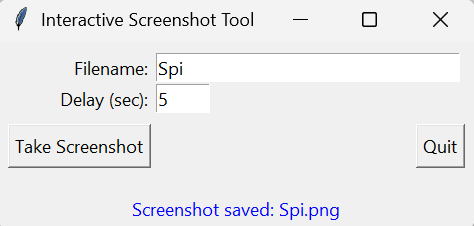

# 📸 Interactive Screenshot Tool

A simple yet handy Python desktop app to **capture screenshots with a custom filename and delay**. Built with `Tkinter` for the GUI and `PyAutoGUI` for screenshot functionality.

---

## 🚀 Features

* 📁 Save screenshots to a custom filename
* ⏲️ Set delay before the screenshot (ideal for preparing your screen)
* 🖼️ Automatically opens the captured image
* 🧼 Clean and minimal GUI with status messages

---

## 🖥️ Preview




---

## 🔧 Requirements

* Python 3.x
* `pyautogui`
* `tkinter` *(comes pre-installed with Python)*

Install dependencies with:

```bash
pip install pyautogui
```

---

## 🧠 How to Use

1. Clone or download this repository.
2. Run the script:

```bash
python screenshot_tool.py
```

3. In the GUI:

   * Enter a filename (e.g., `screenshot1`)
   * Set the delay in seconds (e.g., `5`)
   * Click **Take Screenshot**
4. The tool will wait for your input time, take a screenshot, save it on your desktop, and open it.

---

## 📂 Screenshot Location

All screenshots are saved to:

```bash
C:/Users/Mi/Desktop/
```

Feel free to edit the path in the script to suit your machine.

---

## 📌 Code Highlights

```python
img = pyautogui.screenshot(full_path)
img.show()
```

Just two lines to capture and view the screenshot after the specified delay!

---

